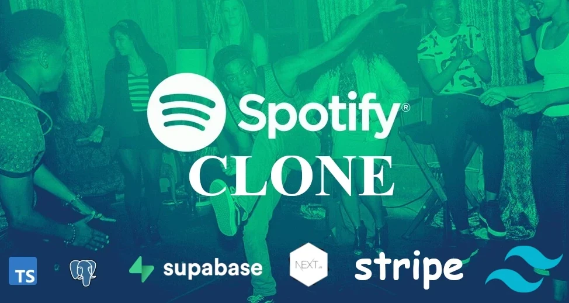

<!-- Introduction Text -->
<div align="center">
    <h1>Spotify Clone</h1>
    <h4>(Portfolio Project)<h4>
    <h3> 🎯🎯🎯 - insert live-link here -  🎯🎯🎯 </h3>
        <h6>
            built with <a href="https://nextjs.org">Next.js</a> &
            hosted by <a href="https://vercel.com/">Vercel</a> 
        </h6>
</div>

<!-- Logo -->
<p align='center'>
    
</p>


<!-- Tech Used in this Project
<p align='center'>
    <a href="https://skillicons.dev">
        
    </a>
</p>
<hr> -->


<!-- -------------------------------------------------------------------------- -->

<h1 align='center'> Welcome & Introductory </h1>

<!-- -------------------------------------------------------------------------- -->


### Brief Introduction:
<!-- -------------------------------------------------------------------------- -->
<hr/>

<!-- Welcome to my Ecommerce Project Repository, a portfolio project of mine!

This project serves as a personal learning experience, allowing me to test my abilities in seeing a project through from start to finish. Rather than replicating existing stores, the focus is on developing robust business logic and integrating various technologies.

My goal was to fully immerse myself in building an ecommerce application, exploring different topics and honing my implementation and integration skills. While efficiency could have been prioritized, the main objective was to gain comprehensive knowledge. -->
<br>


#### Key Features of this project:
<!-- -------------------------------------------------------------------------- -->
<hr>

<!-- Small container -->
<details>
<summary> Click here to see all the features: </summary>
<br/>


<div>
    <ul>
        <li> Song upload
        <li> Stripe integration
        <li> Tailwind design for sleek UI
        <li> Tailwind animations and transition effects
        <li> Full responsiveness for all devices
        <li> Credential authentication with Supabase
        <li> Github authentication integration
        <li> File and image upload using Supabase storage
        <li> Client form validation and handling using react-hook-form
        <li> Server error handling with react-toast
        <li> Play song audio
        <li> Favorites system
        <li> Playlists / Liked songs system
        <li> Advanced Player component
        <li> Stripe recurring payment integration
        <li> Using POST, GET, and DELETE routes in route handlers (app/api)
        <li> Fetch data with server React components by directly accessing the database (without api)
        <li> Handling relations between Server and Child components in a real-time environment
        <li> Cancelling Stripe subscriptions
    </ul> 
</div>

<!-- CLOSING DIV -->
</details>
<br/>


#### Important points to note:
<!-- -------------------------------------------------------------------------- -->
<hr>


<!-- <li> The project places less emphasis on creating visually stunning designs. Instead, it prioritizes building and refining business logic, implementing functionality, and exploring diverse technologies.
<br><br>
<li> The user interface and design maintain a minimalistic and functional approach, allowing a greater focus on learning and development.
<br><br>
<li> This project doesn't aim to create a real store with actual products. Instead, the focus is on building business logic and refining development skills, simulating real-world scenarios and mirroring professional work environments.
<br><br>
You can see all tickets created & closed here  :   <a href="https://github.com/DevonGifford/Ecommerce_Showcase/issues?q=is%3Aissue+is%3Aclosed">Closed Tickets ✅</a> -->

<br><br>


<!-- -------------------------------------------------------------------------- -->

<h1 align='center'> Development Journey</h1>

<!-- -------------------------------------------------------------------------- -->

In this section, I'll guide you through the step-by-step process of bringing this project to life. From initial concept to final implementation, I've documented my progress, highlighting the tools, technologies, and methodologies used along the way.

Join me on this behind-the-scenes adventure as I share exciting milestones, challenges, and valuable lessons learned as a solo developer. Experience the transformation of an idea into a fully functional music streaming service.

<em>Please note that this project was primarily a learning experience. While there may have been more efficient approaches, I intentionally explored specific topics and tested my abilities with various technologies and libraries.</em>
<br>
<hr>

<!-- -------------------------------------------------------------------------- -->
<!-- DEV JOURNEY CONTAINER OPEN -->
<details>
<summary>  Click here to expand and see all the steps I took to build this project: </summary>
<br/><br/>

<!-- -------------------------------------------------------------------------- -->


## 1. PROJECT SETUP & SCAFFOLDING
<!-- -------------------------------------------------------------------------- -->
<hr>

### 🔥💻 Developer Journal Entry - Project Setup 👷‍♂️

 I've been making great progress with the project setup, design, and code implementation. 🚀 <br>
 I set up Git like a pro and got Next.js fired up with all the necessary dependencies. 💪

I've been all about that <strong>mobile-first mindset</strong>, diving deep into the Spotify home page vibes to gather inspiration. 🎧 <br>
Identifying those key components and design elements to replicate has been a game-changer, keeping things smooth and steady. 🎯

<strong>Styling and design?</strong> <br>Already on another level! I've unleashed my creativity with tailwind-merge and reusable components. They're like secret weapons, making the code look sharp and clean, perfect to match Spotify's sleek aesthetics.🔥

<strong>One major lesson I've learned?</strong> <br>Mastering the art of server-side and client-side components. I've been blending them seamlessly, getting the best of both worlds. 🌐

Now that I've built this solid foundation, the Spotify clone project is ready to soar to new heights. 🚀 

That's a wrap on the initial phase of my developer journal for the Spotify clone project. Stay tuned for more exciting updates as I continue on this music streaming adventure. You don't want to miss it! ✌🔥
<em>🎵 EDM beats fades away into the distance...</em>

### For detailed overview of what I did ...


<!-- SECTION container open -->
<details>
<summary> Click here to expand: </summary>
<br>

### PROJECT SETUP
<hr/>

<details>
<summary> Click here to expand: </summary>
<br/><br/>


#### Git Repository Setup
- Created a new Git repository to track project changes.

#### Next.js Project Setup
- Set up a new Next.js project to build the Spotify clone.
- Initialized the project with necessary dependencies and scripts.

##### Boilerplate Code Removal
- Removed unnecessary boilerplate code generated by Next.js.

##### Troubleshooting Errors
- Troubleshooted and resolved errors related to missing modules:

    ```
    ❌Error:
    'next' is not recognized as an internal or external command

    🤔Cause:
    Next.js package is not installed globally or is not accessible from the current working directory.
    
    ✅SOLUTION:
    npm install next
    ```
  
    ```
    ❌Error: 
    Cannot find module 'autoprefixer'
    
    🤔Cause:  
    not accessible from the current working directory.

    ✅SOLUTION:
    npm install autoprefixer
    ```

    ```
    ❌Error: Cannot find module 'tailwindcss'

    🤔Cause:  
    dependency is not installed
    
    ✅SOLUTION:
    npm install tailwindcss
    
    Verify package is in package.json
    npm install autoprefixer --save

    ```

<!--  container closed -->
</details>
<br/>


### Project Design and Styling
<hr/>

<details>
<summary> Click here to expand: </summary>
<br/><br/>


#### Mobile-First Mindset
- Decided to develop the Spotify clone with a mobile-first approach to ensure optimal user experience across devices.

##### Spotify Home Page Analysis
- Analyzed the layout and design of the Spotify home page on both desktop and mobile views.
- Identified key components and visual elements to replicate in the clone.

##### Global CSS Setup
- Created a `globals.css` file to define global styles and replicate Spotify colors and fonts.

##### General Overlay Setup
- Updated the `layout.tsx` file to include a general overlay structure.
- Created a Sidebar component to be visible only on larger screens.
- Utilized the `tailwind-merge` library to achieve custom styling for the sidebar.
- Implemented the main content section with a dynamic sidebar and library component.

<!--  container closed -->
</details>
<br/>

### Code and Libraries
<hr/>

<details>
<summary> Click here to expand: </summary>
<br/><br/>


##### Technologies Used
- Utilized functional components for development.
- Leveraged `next/link` for client-side navigation.
- Employed `next/navigation` package for hooks like `usePathname` and `useRouter`.
- Utilized React library features such as `forwardRef` and `useMemo`.

##### Server and Client Components
- Implemented a mix of server-side and client-side components.
- Used `use client;` to differentiate between server and client rendering.

<!--  container closed -->
</details>
<br/><br/>


### Different Components created
<hr>
<!-- container open -->

<em>If you want a brief description of the different components I have created and what they do ... </em>

<details>
<summary> Click here to expand: </summary>
<br/><br/>

#### layout.tsx File

The `layout.tsx` file defines the root layout for the Spotify clone project. 
It imports the Google Fonts library (`next/font/google`) to set the font for the entire application. 
The `globals.css` file is also imported to apply global styles.

The `RootLayout` component is the main layout wrapper, which sets the document language to English (`en`). It applies the imported font class to the `body` element. The `Sidebar` component is rendered as a sidebar navigation container, and the `children` components are passed as its content.

This layout structure ensures consistent styling and provides a common structure for all pages in the Spotify clone project.

<br/>

#### page.tsx File

The `page.tsx` file represents the main page of the Spotify clone. It includes the `Header` component, which displays a welcome message and a list of recently liked songs. The file also contains a section for displaying the newest songs, which is currently commented out and not implemented.

<br/>

#### Sidebar Component

The `Sidebar` component renders the sidebar section of the Spotify clone, displaying navigation items and a library section. It provides easy navigation and access to the library for a seamless user experience.
<br/>

#### SidebarItem Component

The `SidebarItem` component represents an individual navigation item in the sidebar. It displays an icon and label, and provides a clickable link to navigate to a specific page. It also highlights the active item based on the current URL.
<br/>

#### Box Component

The `Box` component is a wrapper that provides a styled container for its children. It applies a background color, rounded corners, and adjusts its height to fit the content. Additional custom styling can be applied by providing a `className` prop.
<br/>

#### Button Component

The `Button` component renders a styled button element. It has various features such as customizable styles, support for different button types, and handling of disabled state. The button can be used for triggering actions or submitting forms.
<br/>

#### Header Component

The `Header` component represents the header section of the Spotify clone. It includes buttons for navigating back and forward, a home button, a search button, and login/sign-up buttons. The component adapts its rendering based on the screen size to provide a responsive user experience.
<br/>

#### ListItem Component

The `ListItem` component represents an individual item in the liked songs section of the Spotify clone. It displays an image, the name of the song, and a play button. Clicking on the component triggers a navigation to the specified `href`. The component also includes handling for user authentication in future updates.
<br/>

#### Library Component

The `Library` component represents the user's library in the Spotify clone. It displays a heading "Your Library" with a playlist icon. The component also includes a "plus" icon for adding new songs to the library. The list of songs will be dynamically rendered in the commented section that is currently not implemented.


<!--  container closed -->
</details>
<br/>


<!-- SECTION container closed -->
</details>
<br/><br/>
<!-- -------------------------------------------------------------------------- -->


## 2. SUPABASE & DATABASE SETUP & CREATING PROVIDERS
<hr>

### 🔥💻 Developer Journal Entry - Supabase & Database Setup 🚀

In this developer journal entry, I totally rocked the Supabase setup and nailed the configuration of the database for Stripe integration and song storage 🎵🔒. I am really impressed with how Supabase made the whole process user-friendly, what a difference good documentation does <em>(better than Firebase IMO 🤫)</em>. I got those public and private keys locked and loaded, ready for action 🔑.

But wait, there's more! I <strong>flexed my database skills</strong> by manually setting up the "liked_songs" and "songs" databases like a true database wizard ✨🎩. And of course, I had to add some extra 🔒RLS (Row-Level Security) policies to keep things secure and locked down. </br> To take it up another notch, I <strong>created buckets</strong> to store songs and images, and added rules and policies to ensure only the right types of files can enter the party 🎧📸. Security on point! 🛡️ <br/>
But hold up, there's a plot twist! I also <strong>whipped up some 🔥 types</strong> in the "types.ts" file using Supabase CLI. This brought a whole new level of type safety to the project, keeping everything solid and error-free 💪.

<strong>One major lesson I've learned?</strong> <br/> Hooks in Next.js! 🎣 I dived into the ocean of hooks and discovered their true potential. I unveiled the power of hooks by creating custom hooks like "useUser." These hooks opened up a world of possibilities and allowed me to harness the power of Supabase authentication and session management effortlessly. It was like wielding a magic wand in the realm of user-related data and authentication state! 🪄✨

I encapsulated user-related data and authentication state, granting the entire application access to the enchanting powers of the "useUser" hook. Brace yourself, Next.js, as I cast more custom hooks into this Spotify clone! 🪄🎣🎮🌟

In conclusion, this developer journal entry has taken us on a journey of Supabase setup, database magic, type sorcery, and provider mastery. We've built a rock-solid foundation for a secure and feature-packed application powered by Supabase. Apologies for all the fish/sea puns - power of custom hooks got me hooked. 🎣😅  

Stay tuned for the next thrilling chapter! 🚀🔒💪

### For detailed overview of what I did ...


<!-- -------------------------------------------------------------------------- -->
<!-- SECTION container open -->
<details>
<summary> Click here to expand: </summary>
<br>
<!-- -------------------------------------------------------------------------- -->

### Seting Up SuperBase and DataBase
<hr>
<!-- container open -->
<details>
<summary> Click here to expand: </summary>
<br>

#### created superbase account 
really impresse with this 
far more user friendly than firebase 

- got the public, private keys


#### setup database for stripe
- supabase has a greate feature to help you write a script to create the perfect database for stripe


#### setup database for songs
manually set up the database's for
- `liked_songs` 
- `songs`


#### created RLS policies for the databases

#### For the `song` database:
-  Enabled read access for all users
-  Enabled insert access for authenticated users only
  
```
CREATE POLICY "Enable insert for authenticated users only" ON "public"."songs"
AS PERMISSIVE FOR INSERT
TO authenticated

WITH CHECK (true)
```

#### For the `liked_songs` database:
- Enabled read access for all users

```
CREATE POLICY "Enable read access for all users" ON "public"."liked_songs"
AS PERMISSIVE FOR SELECT
TO public
USING (true)
```
- Enabled read access for all users
```
CREATE POLICY "policy_name"
ON public.liked_songs
FOR INSERT 
TO authenticated 
WITH CHECK (true);
```
- Enable delete for users based on user_id
```
CREATE POLICY "policy_name"
ON public.liked_songs
FOR DELETE USING (
  auth.uid() = user_id
);
```


#### created buckets to store songs & images
- creating rules to restrict to only certain type of files
- creating policies to protect the buckets


#### Creating types for SupaBase

[Generating types using Supabase CLI documentation](https://supabase.com/docs/guides/api/rest/generating-types)


```npm i supabase@">=1.8.1" --save-dev```

- generating a login key

- loggin in via CLI

- Then running the following to generate `types_db.ts` 

```
npx supabase gen types typescript --project-id INSERT_PROJ_ID_HERE --schema public > types_db.ts
```

This created a `typed_db.ts` file in the project and that will help alot with type saftey 


<!-- container closed -->
</details>
<br/><br/>


### Creating Providers for Auth & SupaBase
<hr>
<!-- container open -->
<details>
<summary> Click here to expand: </summary>
<br>

#### created Supabase Provider

-  created providers folder, this will come in handy later for variouse reasons
-  created `SupabaseProvider.tsx`

Documentation: 

[createClientComponentClient](https://supabase.com/docs/guides/auth/auth-helpers/nextjs)

```
configures Supabase Auth to store the user's session in a cookie, rather than localStorage. This makes it available across the client and server of the App Router - Client Components, Server Components, Server Actions, Route Handlers and Middleware. The session is automatically sent along with any requests to Supabase.
```

[SessionContextProvider](https://supabase.com/docs/guides/auth/auth-helpers/nextjs-pages)

```
This submodule provides convenience helpers for implementing user authentication in Next.js applications using the pages directory.
```

The SupabaseProvider.tsx component is responsible for setting up the Supabase client and providing it to the application. It uses the createClientComponentClient function from the @supabase/auth-helpers-nextjs package to create the Supabase client instance. The component wraps the application's children with the SessionContextProvider from the @supabase/auth-helpers-react package, passing the Supabase client as a prop. This allows the application to access the Supabase client and manage user authentication and session state throughout the application.

#### created types.tsx 

To assist with the useUser hooks I am going to create a type file, called `types.ts` in the root of the application 

The types.tsx file contains a collection of TypeScript interfaces that define the data structures used in the project. These interfaces represent various entities such as songs, products, prices, customers, user details, product with price, and subscriptions. They provide a structured way to define and work with these data types, making it easier to handle and manage data throughout the application. The file serves as a central location for defining and importing these interfaces, ensuring consistent and type-safe data usage across the project.

##### in the layout.tsx

Now we can wrap the `<Sidebar>` & `{children}` with the newly created `SupaBaseProvider`

This is how we give our application access to client-superbase


#### Created useUser Hook

- created hooks folder, I will have to create many hooks 
- created `useUser.tsx`

The `useUser.tsx` file contains a custom hook (`useUser`) and a context provider `MyUserContextProvider` for managing user-related data and authentication state.

The `MyUserContextProvider` component sets up the user context using the `createContext` function from React. 

It retrieves the user session, loading status, and Supabase client using the `useSessionContext` and `useSupaUser` hooks from the `@supabase/auth-helpers-react package`.
It also defines state variables for user details and subscription information.

The component uses `useEffect` to fetch the user details and subscription data from the Supabase database. It makes use of the Supabase client to perform the necessary queries and updates the corresponding state variables accordingly.

The useUser hook allows components to access the user context and retrieve the user-related data. It throws an error if used outside the `MyUserContextProvider` context.

Overall, these components provide a convenient way to manage user authentication and retrieve user details and subscription information in a Supabase-powered application.

#### Created userProvider

- created in the providers folder
- used this in the `layout.tsx` and wrapped around the `<Sidebar>` & `{children}`

The purpose of the `UserProvider` component is to provide the user context to its child components, allowing them to access user-related data and authentication state through the useUser hook.<br>
By using the `UserProvider` component in the application's component hierarchy (`layout.tsx`), the child components can benefit from the user context and utilize the user-related functionality provided by the useUser hook.

The UserProvider.tsx file exports a component called `UserProvider` that wraps the `MyUserContextProvider` from the useUser hook. It sets up the user context and provides it to the child components.<br>
The `UserProvider` component takes in a children prop, which represents the child components that will be wrapped within the user context. It renders the `MyUserContextProvider` component and passes the children prop as its children.

<!-- container closed -->
</details>
<br/><br/>

<!-- -------------------------------------------------------------------------- -->
<!-- SECTION container closed -->
</details>
<br/><br/>
<!-- -------------------------------------------------------------------------- -->


## 3. AUTHENTICATION MODAL & FUNCTIONALITY
<hr>

### 🔥💻 Developer Journal Entry - Authentication modal & Functionality 

In this epic developer journal entry, I unleashed a plethora of new features, taking this project to new heights of user delight! 🚀💥

First and foremost, I dropped a 🔥 <strong>authentication modal functionality bomb</strong>, empowering users to effortlessly log in, log out, create accounts, reset passwords, and even receive magical links for instant access.
This turbocharges the user experience and fortifies the app's security like a fortress! 🔒🏰
<br>
To supercharge the authentication process, I harnessed the power of Supabase and its stunning authentication UI, enabling users to sign in with a single click using their GitHub credentials! 
<br>
Talk about <strong>seamless user registration</strong> and <strong>rock-solid trustworthiness!</strong> ⚡💪

Not stopping there, I summoned the mystical powers of Radix UI components, infusing the Spotify clone with an otherworldly interface that's both visually <strong>stunning and effortlessly accessible</strong>. With Radix UI's flexible and modular components, I molded a design system that's as adaptable as a shape-shifting ninja, ready to conquer any design challenge that comes its way! 🐱‍👤✨

But wait, there's more! I harnessed the enchanting spells of the react-hot-toast library, conjuring up mesmerizing and customizable notifications. With these sublime toast notifications, I'm able to deliver important messages to users with style and grace, like a magical messenger from the digital realms! 🧙‍♂️🌟

In conclusion, these new features have transformed the Spotify clone into an absolute legend of an application! The authentication modal, Supabase integration, Radix UI components, and toast notifications have combined forces to create an unrivaled user experience that will leave users in awe and begging for an encore! 🎶🔥 

With these mystical enhancements, the Spotify clone is now primed to deliver an epic music streaming experience that will rock users' worlds like a legendary stadium concert! 🎸🔥

### For detailed overview of what I did ...

<!-- -------------------------------------------------------------------------- -->
<!-- SECTION container open -->
<details>
<summary> Click here to expand: </summary>
<br>
<!-- -------------------------------------------------------------------------- -->


### Goals accomplished:
<hr>
<!-- container open -->
<details>
<summary> Click here to expand: </summary>
<br>

During this development phase, I successfully implemented the following user authentication functionalities:

- Login and logout capabilities
- Account creation
- Password reset functionality
- Magic link sending feature

<!-- container closed -->
</details>
<br/><br/>

### Deatailed look at all the steps I took: 
<hr>
<!-- container open -->
<details>
<summary> Click here to expand: </summary>
<br>

#### 1.  Creating `ModalProvider` Skeleton

<!-- container open -->
<details>
<summary> Click here to expand: </summary>
<br>

    1.  using the `"use cilent;"`
    2.  using a useEffect trick so that we dont have rehydration issues in server components  
    3.  placing above `<Sidebar>` & `{children}` - selfclosing 

<!-- small section closed -->
</details>
<br/><br/>

#### 2.  Creating `Modal.tsx` component using Radix-ui Library 

<!-- container open -->
<details>
<summary> Click here to expand: </summary>
<br>
   
<strong>What is radix?</strong>

[Radix](https://www.radix-ui.com/)
>An open-source UI component library for building high-quality, accessible design systems and web apps.<br>Low-level UI component library with a focus on accessibility, customization and developer experience. You can use these components either as the base layer of your design system, or adopt them incrementally. <br>Each primitive can be installed individually so you can adopt them incrementally.

1.  created the skeleton

2.  In this project, specifcally the newly created `Modal.tsx` I will be using:

    ```npm install @radix-ui/react-dialog```
    and importing everything using 
    ```import * as Dialog from "@radix-ui/react-dialog"```

3.  I defined the interface for the ModalProps, specifying the prop types required for the Modal component.

4.  I created the Modal functional component, accepting the props passed to it

5.  Inside the component, I wrapped the content with the `Dialog.Root` component, providing the open and onOpenChange props to control the visibility of the modal.

6.  Within the `Dialog.Root`, I used `Dialog.Portal` to render the modal content as a sibling of the root of the React tree, ensuring it overlayed the other elements.

7.  I structured the modal content using `Dialog.Content`,` Dialog.Title`, `Dialog.Description`, and any additional child components passed to the Modal component.

8.  I added the close button using `Dialog.Close` and a button element, providing the necessary styles and an aria-label for accessibility

9. Obviously in the `ModalProvider` I am using some dummy information 
    ```
    <Modal
      title="Test Modal"    
      description='Test Description'
      isOpen
      onChange={() => {}}
    >
        This is where the children will be rendered
    </Modal>
    ```

<!-- small section closed -->
</details>
<br/><br/>

#### 3.  Creating new `useAuthModal.ts` hook with Zustand library 

<!-- container open -->
<details>
<summary> Click here to expand: </summary>
<br>

<strong>What is zustand?</strong>

[Zustand](https://docs.pmnd.rs/zustand/getting-started/introduction)
>A small, fast, and scalable bearbones state management solution. Zustand has a comfy API based on hooks. It isn't boilerplatey or opinionated, but has enough convention to be explicit and flux-like.<br><br>Zustand is perfect for this little project, obviously the real spotfiy uses Redux however I have already spent a fair amount of time using redux and would like to learn about this super light weight state management tool. <br><br>  Beyond that reason Zustand is great for; Simplicity and Ease of Use, Performance & Bundle size, Simpler to setup and configure.

leveraged Zustand to create a custom store for managing the state of the AuthModal component. The store effectively handled the modal's visibility and provided functions to control its opening and closing. By exporting the `useAuthModal` hook, other components could effortlessly tap into the store's state and actions.

1.  I imported the create function from the zustand library. This allowed me to create a custom store with state and actions.
```
npm i zustand
```

1.  Created the `interface AuthModalStore` to shape the state of the store. It included a boolean property isOpen to track the visibility of the modal and two functions `onOpen` and `onClose` to control its opening and closing.

2.  I used the `create` function to create the `useAuthModal` hook. 
Within the callback function passed to create, I defined the initial state and actions for the store. 
Set the initial value of isOpen to false and implemented the onOpen and onClose functions to update the state accordingly.

3.  Lastly, I exported the `useAuthModal` hook, allowing other components to import and utilize it to access the state and actions defined in the store.

4.  Finally updated the `ModalProvider`, where I was using dummy data and replaced it with this new `useAuthModal`

5.  Now that the skeleton is complete, we can add some actual funcitonality, first I installed the relvant packages to link to my supabase 
    1. ```npm i @supabase/auth-ui-react```
    2. ```npm i @supabase/auth-ui-shared```

6.  Following the [supabase documentation](https://supabase.com/docs) I created some constants:

    ```
    const router = useRouter();
    const { session } = useSessionContext();
    const supabaseClient = useSupabaseClient();
    ```ts
    - obviously have the relevant imports for functionality 
    - now I can create the supabase `<auth>`

7. Created and styled the supabase auth
   - imported the relevant requirements
    ```ts
    import { Auth } from "@supabase/auth-ui-react";
    import { ThemeSupa } from "@supabase/auth-ui-shared";
    ```
    - in my render I added the `<Auth>` with some styling
    ```ts
    <Auth
    supabaseClient={supabaseClient}
    providers={['github']}
    magicLink={true}
    appearance={{
    theme: ThemeSupa,
    variables: {
        default: {
        colors: {
            brand: '#404040',
            brandAccent: '#22c55e'
        }
        }
    }
    }}
    theme="dark"
/>
    ```

8.  Importing the `AuthModal` file and 
    -  imported the const and deconstructed the `onClose` & `onOpen`
    -  also added the `onChange` function, as a skeleton for now...
    ```ts
    const {onClose, isOpen} =  useAuthModal();
    const onChange = (open: boolean) => {
        if (!open) {
            onClose();
        }
    }
    ```
    - updated the `<Auth>` to use the above...


9.  Adding functionality to the `header` componenet, to open the log-in and sign-up pages
    -  importing the relavant files
    ```ts
    const authModal = useAuthModal();
    ```
    - updating the buttons onClick to open ie -> `onClick={authModal.onOpen}`
    
10.  Adding a useEffect ot the `AuthModal` to handle the closing of the Modal once the user successfully signs-in or signs-up 
    ```ts
      useEffect(() => {
        if (session) {
        router.refresh();
        onClose();
        }
    }, [session, router, onClose]);
    ```
    - TESTING THE SIGN UP AND IT WORKS (email and password)

<!-- small section closed -->
</details>
<br/><br/>


#### 4.  Setting up GitHub Authentication - quick sign in 

<!-- container open -->
<details>
<summary> Click here to expand: </summary>
<br>

1.  Setting up GitHub OAuth 
    1.  in profile -> settings -> developer settings -> OAuth
    2.  adding localhost
    3.  getting the public and secret key
    4.  REMEMBER TO ADD LIVE SITE HERE FUTURE DEVON
   
2. Linking the GitHub OAuth to our SupaBase
   1. in profile -> settings -> authentication -> profiles ...
   2. add the public and secret key

3. Testing and it works 😁

Please future Devon don't forget to add the livesite URL to our github OAUTH 😜

<!-- small section closed -->
</details>
<br/><br/>


#### 5.  Updating header to render differently depending on sign-in status   

<!-- container open -->
<details>
<summary> Click here to expand: </summary>
<br>

1.  Updating the header with the following constants and relevant imports 
    ```ts
    const supabaseClient = useSupabaseClient();
    const { user } = useUser();
    ```

2.  Creating a handler for the Logout 
    ```ts
    const handleLogout = async () => {
    const { error } = await supabaseCllient.auth.signOut();
    //TODO: Reset any playing songs - once user signs out - songs should stop playing
    router.refresh();

    if (error) {
        console.log(error);
        
    }
    ```

3.  Updating the render to use a ternary to render according to `user`
    1.  created buttons and styled them, to render if the user is logged-in

4.  Testing and it works !

<!-- small section closed -->
</details>
<br/><br/>


#### 6.  Creating Beautiful notifcations with Hot Toast

<!-- container open -->
<details>
<summary> Click here to expand: </summary>
<br>

<strong>What is Hot-Toast?</strong>

[HOT-TOAST](https://react-hot-toast.com/docs)
>A library that provides a simple and customizable toast notification system for React applications. It allows developers to display temporary messages or notifications to users in a visually appealing and non-intrusive manner.<br/><br/> Some benefits of using react-hot-toast include its lightweight size, ease of use, and the ability to customize the appearance and behavior of the toast notifications. <br/><br/>It also provides convenient features like stacking multiple toasts, controlling their duration, and handling various types of notifications, making it a powerful tool for enhancing the user experience in React applications.


1. First I created the `ToasterProvider.tsx`:
   1. I imported the necessary dependencies, including the Toaster component from the react-hot-toast library.

   2. Inside the component, I defined the ToasterProvider function.
   
   3. Within the function, I returned the Toaster component and passed the toastOptions prop to customize the appearance of the toast messages.
   
   4. The toastOptions prop allowed me to set the background color to #333 and the text color to #fff.
   
   5. Finally, I exported the ToasterProvider component so that it can be used throughout the application to provide toast notifications with the defined styling.

2. Adding the `<ToasterProvider />` to the `layout.tsx`
   
3. Back in the `Header`  component 
   ```ts
   import { toast } from "react-hot-toast";
   ```
   -  In the logout handler amending the error message to use toats instead 
    ```ts
    toast.error(error.message);
    ```
<!-- small section closed -->
</details>
<br/><br/>


<!-- container closed -->
</details>
<br/><br/>

### Libraries added  
<hr>
<!-- container open -->
<details>
<summary> Click here to expand: </summary>
<br>

<strong>What is Hot-Toast?</strong>

[HOT-TOAST](https://react-hot-toast.com/docs)
>A library that provides a simple and customizable toast notification system for React applications. It allows developers to display temporary messages or notifications to users in a visually appealing and non-intrusive manner.<br/><br/> Some benefits of using react-hot-toast include its lightweight size, ease of use, and the ability to customize the appearance and behavior of the toast notifications. <br/><br/>It also provides convenient features like stacking multiple toasts, controlling their duration, and handling various types of notifications, making it a powerful tool for enhancing the user experience in React applications.

<br/><br/>

<strong>What is zustand?</strong>

[Zustand](https://docs.pmnd.rs/zustand/getting-started/introduction)
>A small, fast, and scalable bearbones state management solution. Zustand has a comfy API based on hooks. It isn't boilerplatey or opinionated, but has enough convention to be explicit and flux-like.<br><br>Zustand is perfect for this little project, obviously the real spotfiy uses Redux however I have already spent a fair amount of time using redux and would like to learn about this super light weight state management tool. <br><br>  Beyond that reason Zustand is great for; Simplicity and Ease of Use, Performance & Bundle size, Simpler to setup and configure.

<br/><br/>

<strong>What is radix?</strong>

[Radix](https://www.radix-ui.com/)
>An open-source UI component library for building high-quality, accessible design systems and web apps.<br>Low-level UI component library with a focus on accessibility, customization and developer experience. You can use these components either as the base layer of your design system, or adopt them incrementally. <br>Each primitive can be installed individually so you can adopt them incrementally.


<!-- container closed -->
</details>
<br/><br/>


<!-- -------------------------------------------------------------------------- -->
<!-- SECTION container closed -->
</details>
<br/><br/>
<!-- -------------------------------------------------------------------------- -->

## 4. UPLOAD MODAL & FUNCTIONALITY
<hr>

### 🔥💻 Developer Journal Entry - Upload modal & Functionality

I accomplished some essential goals that took this project to the next level! 💥

First, I created a mind-blowing modal for uploading songs to Supabase storage and syncing it with our database. 🎵 This feature delivers an out-of-this-world user experience, providing a slick and intuitive way for users to share their musical creations and elevate our app's vibe. 🎶📤

To <strong>safeguard the precious data</strong>, I implemented 🔒 authentication checks that are tighter than a drumbeat. Only the chosen ones with valid credentials can access the upload functionality, ensuring top-notch data security and keeping those sneaky trolls out! 🙅‍♂️🔐
<br>
With the power of the rad react-hook-form library, I transformed the mundane task of form handling into a hyper-efficient process. 💪✨ Our users now enjoy seamless form validation and submission, creating a <strong>smooth and error-free experience</strong>. No more facepalms! 🙌🎯

The feedback game is looking great with those sizzling-hot toast notifications. 🍞🔥 Users get <strong>instant visual cues</strong> on their actions, it's all about providing that smooth flow and keeping everyone in sync! 📢💃
<br>
And let's not forget the <strong>eye-catching aesthetics!</strong> 😎🎨 By harnessing the magic of Tailwind CSS classes with the help of tailwind-merge, I styled and customized our Input component like a true design maestro. 🎨✨🎛️

This journey pushed my skills to new heights, honing my problem-solving prowess and deepening my understanding of database management on the front-end.  I'm stoked about the progress made and excited to continue...🚀💪


### For detailed overview of what I did ...

<!-- -------------------------------------------------------------------------- -->
<!-- SECTION container open -->
<details>
<summary> Click here to expand: </summary>
<br>
<!-- -------------------------------------------------------------------------- -->


### Goals Accomplished 
<hr>
<!-- container open -->
<details>
<summary> Click here to expand: </summary>
<br>

1. <strong>Created a modal for uploading songs to Supabase storage and creating a new record in the database.</strong>
   - Enhanced user experience by providing a convenient and intuitive way to upload songs, enriching the application's content and functionality.
<br/><br/>
2. <strong>Protected the upload modal on the frontend by checking authentication before granting permission to upload.</strong>
   - Ensured that only authenticated users could access the upload functionality, maintaining data security and preventing unauthorized use of the feature.
<br/><br/>
3. <strong>Implemented form handling, validation, and submission using react-hook-form.
   - Streamlined the form management</strong> process, enhanced data validation, and provided a smoother and more interactive user experience when submitting song details.
<br/><br/>
4. <strong>Integrated toast notifications using react-hot-toast for displaying success and error messages.</strong>
   - Improved user feedback by visually notifying users about the outcome of form submissions, enhancing the overall user experience and providing a clear understanding of the upload process.
<br/><br/>
5. <strong>Utilized Tailwind CSS classes with the help of tailwind-merge to style and customize the Input component.</strong>
   - Enabled consistent and visually appealing styling of input elements, enhancing the overall aesthetics and user interface of the application.

<!-- container closed -->
</details>
<br/><br/>


### Deatailed look at all the steps I took:
<hr>
<!-- container open -->
<details>
<summary> Click here to expand: </summary>
<br>


####  updating the  `library.tsx`
<hr>
<!-- step open -->
<details>
<summary> Click here to expand: </summary>
<br>
```ts
import useAuthModal from "@/hooks/useAuthModal";
import { useUser } from "@/hooks/useUser";
```

create const for the new imports


creading onclick handler 
    -  if user not signed in - open the sign-in page


<!-- step closed -->
</details>
<br/><br/>

#### created `@/hooks/useUploadModal.ts`
<hr>

<!-- step open -->
<details>
<summary> Click here to expand: </summary>
<br>

 - I imported the create function from the zustand library to create a custom store for managing the state of the UploadModal component.

 - I defined the UploadModalStore interface to shape the state of the store, including a boolean property isOpen to track the visibility of the modal, and two functions onOpen and onClose to control its opening and closing.

 - I used the create function to create the useUploadModal hook. Within the callback function passed to create, I defined the initial state and actions for the store. I set the initial value of isOpen to false and implemented the onOpen and onClose functions to update the state accordingly.

 - Finally, I exported the useUploadModal hook, allowing other components to import and utilize it to access the state and actions defined in the store.

Followed by importing and defining this new hook in the library.tsx
```ts
const uploadModal = useUploadModal();
```

adding a return to the onclick handler 
```ts
return uploadModal.onOpen();
```

<!-- step closed -->
</details>
<br/><br/>


#### created `UploadModal.tsx` the components 
<hr>

<!-- step open -->
<details>
<summary> Click here to expand: </summary>
<br>

>responsible for rendering a modal with a form for uploading a song. It leverages the useUploadModal hook to control the modal's visibility and integrates with the react-hook-form library for form management and validation.

- using dummy info for development and skeleton ...

- adding this new `UploadModal` to the `ModalProvider`

    1. I imported the necessary dependencies, including the useState hook from React and the useForm and SubmitHandler types from the react-hook-form library. I also imported the useUploadModal hook that I created earlier.

    2. Inside the UploadModal component, I initialized the isLoading state variable using the useState hook to track the loading state of the form.

    3. I used the useUploadModal hook to access the uploadModal object, which contains the state and actions for controlling the visibility of the modal.

    4. I set up the form using the useForm hook, providing the defaultValues for the form fields.

    5. I defined the onChange function, which is triggered when the modal is closed. It resets the form using the reset function from react-hook-form and calls the onClose action from the uploadModal object to close the modal.

    6. I defined the onSubmit function, which is triggered when the form is submitted. Inside this function, I can implement the logic to upload the form data to Supabase or perform any other necessary actions.

    7. I returned the JSX code, wrapping the form inside the Modal component. I passed the necessary props, such as the title, description, isOpen state, and the onChange function.

    8. Inside the form, I added form fields using the Input component (assuming it is imported) and registered them with the register function from react-hook-form. I also added any necessary validation rules.


##### to set up the form 
<hr>

installing packages: 
```shell
npm i react-hook-form
npm i uniqid
npm install -D @types/uniqid
```

created:
```ts
    const {
        register,
        handleSubmit,
        reset,
      } = useForm<FieldValues>({
        defaultValues: {
          author: '',
          title: '',
          song: null,
          image: null,
        }
      });
```

-  now can use the `reset()` in the onChange handler too

<!-- step closed -->
</details>
<br/><br/>

#### created the `Input.tsx` file
<hr>

<!-- step open -->
<details>
<summary> Click here to expand: </summary>
<br>

>a reusable input element that applies styling based on Tailwind CSS classes. It accepts various props to configure the input's type, disabled state, and other HTML attributes. The forwardRef function allows the component to work seamlessly with React's ref system, enabling proper interaction with the underlying input element.


 1. I imported the necessary dependencies, including the forwardRef function from React, and the twMerge utility function from the tailwind-merge library.

 2. I defined the InputProps interface, which extends the React.InputHTMLAttributes<HTMLInputElement> interface to inherit the props of the HTML input element.

 3. I created the Input component using the forwardRef function. This allows the component to receive a ref as a prop and forward it to the underlying input element.

 4. Inside the Input component, I deconstructed the props to extract the className, type, and disabled props. I also included the spread operator ...props to pass any additional props to the input element.

 5. I returned the JSX code, rendering the input element. I set the type attribute to the provided type prop value and applied the CSS classes using the twMerge utility function. The CSS classes define the styling for the input element, including its width, background color, border, padding, and text appearance. Additionally, I included conditional classes based on the disabled prop value to adjust the styling for disabled inputs.

 6. I set the disabled attribute of the input element to the provided disabled prop value, and passed the ref to the input element using the ref prop.

 7. I added the displayName property to the Input component, which sets the display name for the component in React DevTools.

 8. I exported the Input component as the default export of the module, making it available for use in other components.


<!-- step closed -->
</details>
<br/><br/>

#### Updating the `UploadModal.tsx`
<hr>

<!-- step open -->
<details>
<summary> Click here to expand: </summary>
<br>

##### 1.  Importing the required dependencies and custom hooks:

- Imported useState from "react" for managing loading state.
- Imported useForm and SubmitHandler from "react-hook-form" for form handling.
- Imported custom hooks useUploadModal from "@/hooks/useUploadModal".
- Imported other necessary components like Modal, Input, and Button.

##### 2.  Defining and initializing variables and hooks:

- Declared isLoading state variable using useState to track loading state.
- Initialized uploadModal using the useUploadModal hook.
- Extracted supabaseClient and user using useSupabaseClient and useUser custom hooks respectively.
- Set up form handling using useForm, including defining default form values and registering form fields.

##### 3.  Implementing event handlers:

- Defined the onChange function to handle the modal's open/close state change.
- Reset the form and close the modal when it is closed.

##### 4. Implementing form submission:

- Defined the onSubmit function as an async function to handle form submission.
- Extracted the image and song files from the form values.
- Uploaded the image and song files to the respective Supabase storage buckets using supabaseClient.storage.upload.
- Handled errors during file upload.
- Inserted a new record into the "songs" table in the database using supabaseClient.from("songs").insert.
- Handled any errors during the database insertion.
- Refreshed the router, reset the form, closed the modal, and displayed success or error toasts based on the outcome.

##### 5.  Rendering the component:

- Rendered the Modal component with appropriate props for title, description, open state, and onChange event.
- Wrapped the form inside the Modal component.
- Rendered Input components for song title, artist name, and file selection.
- Rendered a Button component for submitting the form.
- Disabled the form elements and button based on the loading state.


<!-- step closed -->
</details>
<br/><br/>


<!-- container closed -->
</details>
<br/><br/>


### Libraries added
<hr>
<!-- container open -->
<details>
<summary> Click here to expand: </summary>
<br>

##### react-hook-form:

[Documentation](https://react-hook-form.com/)

Purpose: A library for managing forms in React.
Contribution: It provides form validation, input tracking, and submission handling, making it easier to manage and validate form data in the UploadModal component.

##### uniqid:

[Documentation](https://www.npmjs.com/package/uniqid)

Purpose: A library for generating unique IDs.
Contribution: It generates unique IDs that can be used to ensure unique file names when uploading images and songs to Supabase storage, preventing conflicts and ensuring data integrity.
@supabase/auth-helpers-react:

Purpose: A library for authentication and authorization with Supabase.
Contribution: It provides a simplified way to authenticate users, retrieve user information, and manage user sessions, which is essential for securing the UploadModal component and interacting with Supabase services.


<!-- container closed -->
</details>
<br/><br/>


<!-- -------------------------------------------------------------------------- -->
<!-- SECTION container closed -->
</details>
<br/><br/>
<!-- -------------------------------------------------------------------------- -->


<!-- -------------------------------------------------------------------------- -->
<!-- DEV JOURNEY CONTAINER CLOSED -->
</details>
<!-- -------------------------------------------------------------------------- -->

<br/><br/><br/><br/>


## NO(x). TEMPLATE 📃
<hr>

### 🔥💻 Developer Journal Entry - {insert title}

text text text

### For detailed overview of what I did ...

<!-- -------------------------------------------------------------------------- -->
<!-- SECTION container open -->
<details>
<summary> Click here to expand: </summary>
<br>
<!-- -------------------------------------------------------------------------- -->


### HEADING 
<hr>
<!-- container open -->
<details>
<summary> Click here to expand: </summary>
<br>

inset text here

<!-- container closed -->
</details>
<br/><br/>


<!-- -------------------------------------------------------------------------- -->
<!-- SECTION container closed -->
</details>
<br/><br/>
<!-- -------------------------------------------------------------------------- -->


<!-- -------------------------------------------------------------------------- -->
<!-- DEV JOURNEY CONTAINER CLOSED -->
</details>
<!-- -------------------------------------------------------------------------- -->

<br/><br/><br/><br/>


<!-- -------------------------------------------------------------------------- -->

<h1 align='center'> Forking, Running and Deploying </h1>

<!-- -------------------------------------------------------------------------- -->

<hr>
<!-- MAIN container open -->
<details>
<summary> Click here to expand: </summary>
<br>


### 🍴🔱 Forking this repo 🍴🔱
---------------------------------------------------

<!-- SECTION container open -->
<details>
<summary> Click here to see more: </summary>
<br>
    Yes, you are welcome to fork this repo. <br>
    However, please give all proper credit by linking back to me
    <br>
    <h5> You could also give me a star if you like this project 😉⭐ </h5> 
<!-- CLOSED -->
</details>
<br/><br/>


### 🏃‍♂️💨 Running this project locally 🏃‍♂️💨
---------------------------------------------------

<!-- SECTION container open -->
<details>
<summary> Click here to see more: </summary>
<br>

System Requirements:
<ul>
<li>Node.js 16.8 or later.
<li>macOS, Windows (including WSL), and Linux are supported.
</ul>
<br>

First, Install dependencies
```bash
npm install
```
<br>

Second, setup .env file


```js
NEXT_PUBLIC_SUPABASE_URL=
NEXT_PUBLIC_SUPABASE_ANON_KEY=
SUPABASE_SERVICE_ROLE_KEY=

NEXT_PUBLIC_STRIPE_PUBLISHABLE_KEY=
STRIPE_SECRET_KEY=
STRIPE_WEBHOOK_SECRET=
```

<br>

Third, add SQL Tables
<br>
Use `database.sql` file, create songs and liked_songs table 

<br>

Then, run the development server:

```bash
npm run dev
```
<br>

Finally, Open up <code>localhost:3000</code> to view your application. <br>
Open [http://localhost:3000](http://localhost:3000) with your browser to see the result.

<ul>
<li>You can start editing the page by modifying `pages/index.tsx`. The page auto-updates as you edit the file.

<!-- <li>[API routes](https://nextjs.org/docs/api-routes/introduction) can be accessed on [http://localhost:3000/api/hello](http://localhost:3000/api/hello). This endpoint can be edited in `pages/api/hello.ts`.

<li>The `pages/api` directory is mapped to `/api/*`. Files in this directory are treated as [API routes](https://nextjs.org/docs/api-routes/introduction) instead of React pages.

<li>This project uses [`next/font`](https://nextjs.org/docs/basic-features/font-optimization) to automatically optimize and load Inter, a custom Google Font. -->

</ul>

<!-- CLOSED -->
</details>
<br/><br/>


### 👷‍♂️🏗 Deploying on Vercel 👷‍♂️🏗 
---------------------------------------------------

<!-- SECTION container open -->
<details>
<summary> Click here to see more: </summary>
<br>

The easiest way to deploy your Next.js app is to use the [Vercel Platform](https://vercel.com/new?utm_medium=default-template&filter=next.js&utm_source=create-next-app&utm_campaign=create-next-app-readme) from the creators of Next.js.

Check out our [Next.js deployment documentation](https://nextjs.org/docs/deployment) for more details.

This is a [Next.js](https://nextjs.org/) project bootstrapped with [`create-next-app`](https://github.com/vercel/next.js/tree/canary/packages/create-next-app).
<br>
<br>
<br>

<!-- DEV JOURNEY CONTAINER CLOSED -->
</details>
<br/><br/>


<!-- MAIN container closed -->
</details>
<br/><br/>


<h2 align='center'>📃🖋 MIT LICENSE 📃🖋</h2>
<!-- ------------------------------------------------------------------ -->

<p align='center'>
Copyright 2023 - Devon Gifford
</p>
<p align='center'>
Permission is hereby granted, free of charge, to any person obtaining a copy of this software and associated documentation files (the “Software”), to deal in the Software without restriction, including without limitation the rights to use, copy, modify, merge, publish, distribute, sublicense, and/or sell copies of the Software, and to permit persons to whom the Software is furnished to do so, subject to the following conditions:
The above copyright notice and this permission notice shall be included in all copies or substantial portions of the Software.
</p>
<p align='center'>
THE SOFTWARE IS PROVIDED “AS IS”, WITHOUT WARRANTY OF ANY KIND, EXPRESS OR IMPLIED, INCLUDING BUT NOT LIMITED TO THE WARRANTIES OF MERCHANTABILITY, FITNESS FOR A PARTICULAR PURPOSE AND NONINFRINGEMENT. IN NO EVENT SHALL THE AUTHORS OR COPYRIGHT HOLDERS BE LIABLE FOR ANY CLAIM, DAMAGES OR OTHER LIABILITY, WHETHER IN AN ACTION OF CONTRACT, TORT OR OTHERWISE, ARISING FROM, OUT OF OR IN CONNECTION WITH THE SOFTWARE OR THE USE OR OTHER DEALINGS IN THE SOFTWARE.
</p>